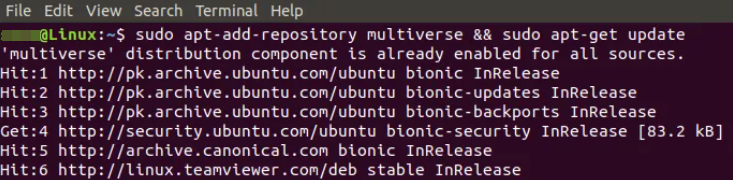
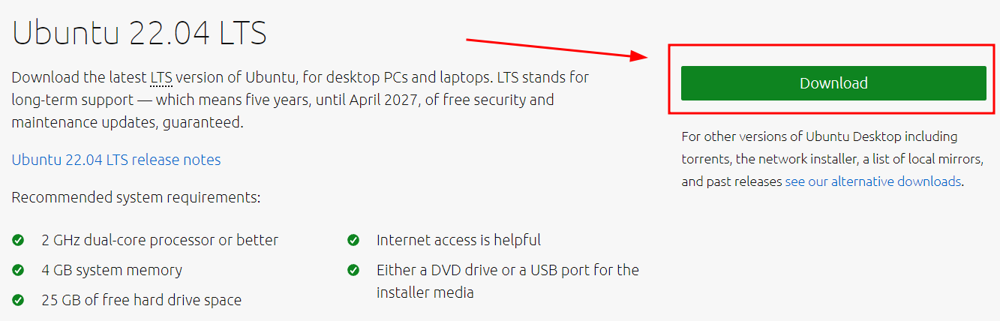

# Instalación de laboratorio

En esta primera sección crearemos el laboratorio de análisis de aplicaciones móviles. El diagrama que seguiremos será el siguiente:


## Prerrequisitos

Lo primero que tenemos que hacer es instalar el software necesario para poder crear una máquina virtual. Una máquina virtual es, sencillamente, una computadora dentro de otra computadora. Esto nos permite, por ejemplo, correr el sistema operativo Linux en Windows (o viceversa) y, además, agrega una serie de beneficios de seguridad. 

Es la manera más sencilla de construir nuestro laboratorio de análisis sin tener que modificar la instalación de nuestro sistema operativo principal y además permite hacerlo en MacOS, Windows o Linux. Debemos notar que en este tutorial nos enfocaremos en Windows y Linux.

Para poder crear una máquina virtual, se pueden usar varios programas, aquí recomendamos el uso de VirtualBox o de VMWare. (Para MacOs existe VMWare Fusion y Parallels). Los dos son gratuitos, aunque VMWare tiene una versión de paga. 

Si el sistema operativo de base es Linux, recomendamos utilizar VirtualBox, si es Windows, VMWare. Esto por cuestiones de estabilidad y fluidez. 

Hay varias maneras de instalar los prerequisitos. En cada momento diremos las ventajas y desventajas de cada método y dejaremos links a tutoriales.

- Paso 1a: Instalar el servidor de máquinas virtuales VirtualBox en Ubuntu. 
    - Para instalar virtualbox en Ubuntu (o cualquier sistema basado en Ubuntu como, Linux Mint, Linux Lite, Kubuntu, Lubuntu, etc.) ir a la consola y escribir: 
   
    ``` 
    sudo add-apt-repository multiverse && sudo apt-get update
    ```
    El primer comando *add-apt-repository multiverse* activa el repositorio de programas *multiverse* en Ubuntu. Esto lo que hace es permitir que, desde ese repositorio, se instalen programas.   

    El segundo comando, *sudo apt update*, sirve para actualizar desde internet la información de los paquetes que se quieren instalar y las fuentes desde donde se van a instalar. Básicamente permite saber qué paquetes están desactualizados y evita que uno instale un paquete "viejo". 
    
    Es importante usar este comando siempre antes de instalar nada nuevo. El comando *sudo* nos da privilegios temporales de administrador. En linux, por seguridad, hay comandos que no se pueden ejecutar con los permisos que tiene un usuario corriente.
    
    
    - Luego, con el siguiente comando instalaremos VirtualBox:
    ```
    $ sudo apt install virtualbox
    ```
    Este comando descargará los paquetes necesarios de instalación y ejecutará todos los procesos necesarios. En algún moento dirá si quiere continuar. Dar enter.

     

    Para ejecutar VirtualBox, poner el siguiente comando en la consola. 
    ~~~
    $ virtualbox
    ~~~

- Paso 1b: Instalar el servidor de máquinas virtuales VMWare en Windows.
    - Descargar el archivo ejectuable desde este [enlace](https://customerconnect.vmware.com/en/downloads/details?downloadGroup=WKST-PLAYER-1623-NEW&productId=1039&rPId=85399).

    
    - Ir a la carpeta de descargas y dar doble click al archivo. Seguir las instrucciones de instalación.


- Paso 2a: Creación de una máquina virtual con Ubuntu en VirtualBox.
*Dejamos aquí el [link](https://ubuntu.com/tutorials/how-to-run-ubuntu-desktop-on-a-virtual-machine-using-virtualbox#2-create-a-new-virtual-machine) al tutorial proporcionado por Ubuntu*. 
    - En resumen hay que hacer lo siguiente:
        - Bajar una imagen de Ubuntu desde este [link](https://ubuntu.com/download/desktop)
        
        - Ejecutar VirtualBox
        - Crear una máquina virtual. 


Dejamos aquí los links a guías de instalación de los prerequisitos:


1. Ubuntu o Linux Mint instalado en nuestra computadora
    - [Guía de instalación](https://linuxmint-installation-guide.readthedocs.io/en/latest/) de Linux Mint
2. VirtualBox instalado
    - [Guía de instalación](https://www.virtualbox.org/wiki/Downloads) de VirtualBox
3. Máquina Virtual con Ubuntu Server 20.04
    - [Guía de creación](https://ubuntu.com/tutorials/how-to-run-ubuntu-desktop-on-a-virtual-machine-using-virtualbox) de una máquina virtual
    - [Guía de instalación](https://ubuntu.com/server/docs/installation) de Ubuntu Server
4. Configurar el modo de red de la máquina virtual a "bridged" o "puente".
    - En VirtualBox elegir la máquina, ir a "Configuración" -> "Red" -> "Conectado a" y seleccionar "Adaptador puente"
    - Para verificar será necesario ingresar a la máquina virtual y desde una terminal ejecutar el comando `IP a | grep -w inet`. Si una de las direcciones es similar a `192.168.X.X` la configuración es correcta.

## Instalación del servidor OpenVPN

Continuaremos con la instalación del servidor VPN en la máquina virtual que creamos. Después de iniciar la máquina virtual, desde una terminal seguiremos los siguientes pasos.

Descargaremos el siguiente script (programa) que facilita la instalación:

```bash
curl -O https://raw.githubusercontent.com/angristan/openvpn-install/master/openvpn-install.sh
```

Cambiaremos los permisos de ejecución del script:

```bash
chmod +x openvpn-install.sh
```

Ejecutaremos el script:

```bash
sudo bash openvpn-install.sh
```   

Nos encontraremos con un asistente de instalación que nos hará unas preguntas. Si en la primera pregunta la IP es de la forma 192.168.X.X, entonces presionar `Enter`. En caso de que la dirección IP no sea similar, necesitaremos verificar que la máquina virtual esté en el modo de red "puente".

```
I need to know the IPv4 address of the network interface you want OpenVPN listening to.
Unless your server is behind NAT, it should be your public IPv4 address.
IP address: 192.168.1.126
```

En la siguiente pregunta, el script reconocerá la IP pública, aceptar.   

```
It seems this server is behind NAT. What is its public IPv4 address or hostname?
We need it for the clients to connect to the server.
Public IPv4 address or hostname: 111.222.333.444
```

Recomendamos negar el uso de conectividad por IPv6.

```
Checking for IPv6 connectivity...

Your host appears to have IPv6 connectivity.

Do you want to enable IPv6 support (NAT)? [y/n]: n
```

Seleccionamos un puerto, podemos elegir el puerto por defecto.

```
What port do you want OpenVPN to listen to?
   1) Default: 1194
   2) Custom
   3) Random [49152-65535]
Port choice [1-3]: 1
```

Seleccionamos el protocolo UDP:

```
What protocol do you want OpenVPN to use?
UDP is faster. Unless it is not available, you shouldn't use TCP.
   1) UDP
   2) TCP
Protocol [1-2]: 1
```

Seleccionamos el DNS de CloudFlare:   

```
What DNS resolvers do you want to use with the VPN?
   1) Current system resolvers (from /etc/resolv.conf)
   2) Self-hosted DNS Resolver (Unbound)
   3) Cloudflare (Anycast: worldwide)
   ...
   13) Custom
DNS [1-12]: 3
```

Evitamos usar compresión:

```
Do you want to use compression? It is not recommended since the VORACLE attack makes use of it.
Enable compression? [y/n]: n
```

No modificaremos las opciones de cifrado:   

```
Do you want to customize encryption settings?
Unless you know what you're doing, you should stick with the default parameters provided by the script.
Note that whatever you choose, all the choices presented in the script are safe. (Unlike OpenVPN's defaults)
See https://github.com/angristan/openvpn-install#security-and-encryption to learn more.

Customize encryption settings? [y/n]: n
```

Continuamos con la instalación, automáticamente se instalará algunos paquetes y si todo fue correcto el script nos pedirá el nombre del cliente. Este nombre puede ser aleatorio.

```
Tell me a name for the client.
The name must consist of alphanumeric character. It may also include an underscore or a dash.
Client name: vpn-qttd
```

Después se puede agregar una contraseña, aunque no es necesaria:

```
Do you want to protect the configuration file with a password?
(e.g. encrypt the private key with a password)
   1) Add a passwordless client
   2) Use a password for the client
Select an option [1-2]: 1
```

Si no hubo ningún error, tendremos la siguiente información:   

```
Write out database with 1 new entries
Data Base Updated

Client vpn-qttd added.

The configuration file has been written to /home/user/vpn-qttd.ovpn.
Download the .ovpn file and import it in your OpenVPN client.
```

Lo siguiente será mover a la carpeta `/etc/openvpn/server` los siguientes archivos y directorios.

```
$ cd /etc/openvpn/
sudo mv ca.* crl.pem easy-rsa ipp.txt server.conf server_* tls-crypt.key server
```

En la carpeta `/etc/openvpn/` sólo deberían estar los siguientes archivos y directorios:

```
$ ls /etc/openvpn/
ccd  client  client-template.txt  server  update-resolv-conf
```

Habilitamos el servicio de OpenVPN:

```
sudo systemctl enable openvpn-server@server.service
```

Ahora reiniciamos el servidor y después de que haya arrancado verificamos que el servicio de OpenVPN se haya ejecutado sin errores.

```
$ sudo systemctl status openvpn-server@server.service
● openvpn-server@server.service - OpenVPN service for server
     Loaded: loaded (/lib/systemd/system/openvpn-server@.service; enabled; vendor preset: enabled)
     Active: active (running) since Tue 2022-04-05 22:38:44 UTC; 15h ago
       Docs: man:openvpn(8)
             https://community.openvpn.net/openvpn/wiki/Openvpn24ManPage
             https://community.openvpn.net/openvpn/wiki/HOWTO
   Main PID: 677 (openvpn)
     Status: "Initialization Sequence Completed"
```

## Instalación de Tshark

Instalaremos `tshark` para capturar el tráfico desde la máquina huésped generado por el celular.

```
sudo apt install tshark
```

## Recuperación y edición del archivo de cliente

Finalmente tenemos que modificar el archivo `.ovpn` generado en la máquina virtual, con un editor de texto cambiaremos la dirección IP del campo `remote` por la IP local de la máquina virtual.

```
remote 192.168.1.126 1194
```

Luego necesitaremos enviar el archivo al celular, podemos hacerlo desde la máquina virtual habilitando un servidor web temporal:

```bash
python3 -m http.server 8000
```

Desde un navegador web en nuestro celular visitaremos la página usando la dirección IP local de la máquina virtual y agregando el puerto 8000 al final. Para nuestro caso sería [192.168.1.199:8000](192.168.1.199:8000), una vez dentro podemos seleccionar el archivo y este se descargará al celular.

## Instalación de OpenVPN en el celular
 
Descargamos desde la tienda de Google Play la aplicación OpenVPN.


Abrimos la aplicación e ingresamos a "FILE" para usar el archivo `.openvpn` que copiamos al celular.


Seleccionamos la carpeta donde tenemos nuestro archivo de cliente.


Lo seleccionamos y le damos importar.


Seleccionamos "Connect after import", luego "ADD" y aceptamos la advertencia de seguridad.


Ahora el celular debería estar conectado a la VPN.


Los siguientes pasos serán capturar el tráfico generado y analizar este mismo.
